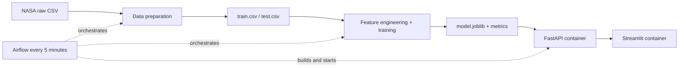

# Exoplanet Mass Lab

An end-to-end MLOps pipeline that estimates an exoplanet's mass from planetary,
orbital, and stellar parameters. It uses a reproducible snapshot of the official
NASA Exoplanet Archive, trains a regression model, exposes it through FastAPI,
and provides a Streamlit web interface.

This repository implements all three stages required by PMLDL Assignment 1:
data engineering, model engineering, and deployment. Apache Airflow connects the
stages and runs the complete pipeline every five minutes.

## Architecture



The API and web application run in separate Docker containers on the same
Compose network. Streamlit never loads the model directly; it obtains every
prediction through the API.

## Dataset and prediction task

The raw data comes from the NASA Exoplanet Archive Planetary Systems Composite
Parameters (`pscomppars`) table. This table provides one composite row per
confirmed planet. The committed snapshot contains 6,292 planets and the exact
TAP query is preserved in `code/datasets/download_data.py`.

- Target: planet mass in Earth masses (`pl_bmasse`).
- Inputs: radius, orbital period, semi-major axis, eccentricity, equilibrium
  temperature, host-star temperature/radius/mass, system multiplicity, and
  discovery method.
- Source documentation:
  [column definitions](https://exoplanetarchive.ipac.caltech.edu/docs/API_PS_columns.html)
  and [TAP API guide](https://exoplanetarchive.ipac.caltech.edu/docs/API_resources.html).
- NASA Exoplanet Archive DOI: `10.26133/NEA2`.

The snapshot is committed so a demonstration does not require internet access.
Running `make download` deliberately refreshes it and may change row counts and
metrics as NASA publishes new data.

## Pipeline stages

### 1. Data engineering

`code/datasets/prepare_data.py`:

1. validates the schema and converts numeric fields;
2. removes duplicate planet names;
3. removes invalid measurements and physical outliers, including objects above
   the conventional 13-Jupiter-mass planetary boundary;
4. creates an 80/20 train/test split stratified by logarithmic mass bins;
5. learns median/mode imputation values from the training fold only;
6. saves clean datasets and a detailed preparation report.

Outputs:

- `data/processed/train.csv`
- `data/processed/test.csv`
- `data/processed/preparation_summary.json`

### 2. Model engineering

`code/models/train.py` builds one serializable scikit-learn pipeline:

- median imputation as a safety layer;
- `log1p` transformation of skewed positive features;
- scaling of numerical features;
- one-hot encoding of discovery method;
- `RandomForestRegressor`;
- `log1p` target transformation with automatic inverse transformation.

Density, surface gravity, and mass expressed in Jupiter units are intentionally
excluded because they are derived from the target and would leak the answer.

Outputs:

- `models/model.joblib`
- `models/model_metadata.json`
- `metrics/metrics.json`
- `metrics/feature_importance.csv`
- `metrics/test_predictions.csv`

Metrics for the committed snapshot:

| Metric | Value |
|---|---:|
| R² | 0.792 |
| RMSLE | 0.601 |
| Median absolute error | 1.28 Earth masses |
| Predictions within a factor of two | 87.3% |

### 3. Deployment

FastAPI provides:

- `GET /health`
- `GET /model-info`
- `POST /predict`
- interactive OpenAPI documentation at `/docs`

Streamlit contains planetary and stellar input fields, three example presets,
and displays the predicted mass in both Earth and Jupiter masses.

## Repository structure

```text
├── code
│   ├── datasets
│   │   ├── download_data.py
│   │   └── prepare_data.py
│   ├── models
│   │   └── train.py
│   └── deployment
│       ├── api
│       │   ├── main.py
│       │   └── Dockerfile
│       ├── app
│       │   ├── app.py
│       │   └── Dockerfile
│       ├── docker-compose.yml
│       └── healthcheck.py
├── data
│   ├── raw
│   └── processed
├── metrics
├── models
├── services/airflow/dags
├── tests
├── Makefile
└── requirements.txt
```

## Prerequisites

- macOS, Linux, or Windows with WSL2
- Python 3.11 recommended
- Docker Desktop with Docker Compose v2
- approximately 4 GB of free memory for Docker and Airflow

On macOS, install Python if necessary:

```bash
brew install python@3.11
```

Install and start
[Docker Desktop](https://docs.docker.com/desktop/setup/install/mac-install/)
before running the deployment stage.

The Makefile and Airflow DAG automatically detect Docker Desktop at its standard
macOS application path even if the `docker` command has not yet been added to
the terminal `PATH`.

## Environment setup

The Makefile installs Airflow with its official constraints file:

```bash
python3.11 -m venv .venv
source .venv/bin/activate
make install
```

On macOS, `make airflow` automatically activates the small compatibility shim
in `services/airflow/macos_compat`. It prevents Airflow 2.10 from calling
`setproctitle` after `fork()`, which crashes native workers on macOS 26. Process
names are cosmetic; scheduling, task execution, logs, and the UI are unchanged.

All following commands assume that the virtual environment is active and the
current directory is the repository root.

## Run and verify each stage

The raw snapshot is already included. To reproduce processing and training:

```bash
make prepare
make train
make test
```

Start the two application containers:

```bash
make deploy
```

Open:

- Streamlit application: http://localhost:8501
- FastAPI documentation: http://localhost:8000/docs
- API health endpoint: http://localhost:8000/health

Test a prediction from the terminal:

```bash
curl -X POST http://localhost:8000/predict \
  -H 'Content-Type: application/json' \
  -d '{
    "planet_radius_earth": 1.0,
    "orbital_period_days": 365.25,
    "semi_major_axis_au": 1.0,
    "eccentricity": 0.0167,
    "equilibrium_temperature_k": 255,
    "stellar_temperature_k": 5772,
    "stellar_radius_solar": 1.0,
    "stellar_mass_solar": 1.0,
    "star_count": 1,
    "known_planet_count": 1,
    "discovery_method": "Transit"
  }'
```

Stop the application:

```bash
make stop
```

## Automatic pipeline with Airflow

Keep Docker Desktop running, then start Airflow:

```bash
source .venv/bin/activate
make airflow
```

`airflow standalone` prints the local administrator username and password.
Open http://localhost:8080 and locate `exoplanet_mass_pipeline`.

The DAG schedule is `*/5 * * * *`, `catchup` is disabled, and only one active
run is allowed. A run performs:

```text
prepare_data → train_and_evaluate → build_and_deploy → api_health_check
```

New DAGs are configured as unpaused by the Make target. If an older local
Airflow database remembers the DAG as paused, enable it in the UI or run:

```bash
AIRFLOW_HOME="$(pwd)/services/airflow" airflow dags unpause exoplanet_mass_pipeline
```

For an immediate demonstration instead of waiting for the schedule:

```bash
AIRFLOW_HOME="$(pwd)/services/airflow" airflow dags trigger exoplanet_mass_pipeline
```

The scheduler and laptop must remain running for five-minute automation. For
the assignment demonstration, show the Airflow graph and logs, the two running
containers, `/health`, and a prediction made through Streamlit.

## Manual full pipeline

Without Airflow, the same ordered stages can be executed once with:

```bash
make pipeline
python code/deployment/healthcheck.py
```

## Limitations

- The project estimates mass from published composite parameters; it does not
  replace radial-velocity, transit-timing, or other physical measurements.
- Composite parameters may originate from different publications and are not
  guaranteed to form a fully self-consistent physical solution.
- Planet mass spans several orders of magnitude, so MAE/RMSE are dominated by
  giant planets. RMSLE, median error, and factor-of-two accuracy are included
  for a more representative evaluation.
- The displayed mass band is descriptive and does not establish composition or
  habitability.
